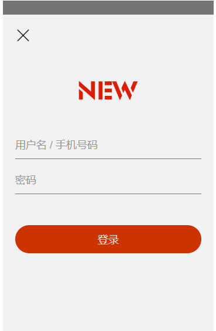

# 黑马头条


## 项目笔记


	### 登录页

​		思路：

```js	
先完成静态页面，再根据需求完成输入框中数据的传递提交，在服务器端处理后返回前台，或是登录成功或是提示错误。

1.在main.js中插入占位符，在App.vue中写入公共样式，以及导入所需的插件，以用于后面子组件的引用
2.创建一个登录页面，将静态页面html代码写在这个文件，给登录按钮添加点击事件，使用axiso（类似ajax请求）获取到服务器数据，判定后登录或提示
3.创建一个AuthInput.vue文件，用于提取input输入框的所有属性进行封装，方便用于以后项目的所有input。作为login.vue的子组件。动态获取到输入框的数据并且传递给登录页。实现登录功能
```





